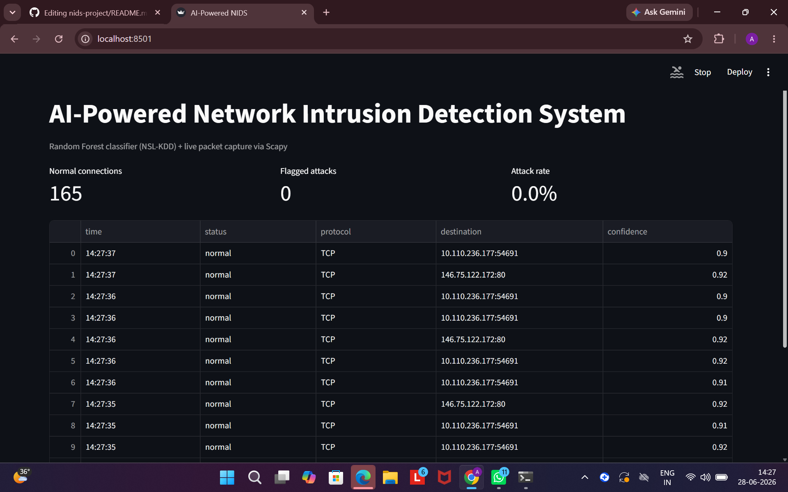

# AI-Powered Network Intrusion Detection System (NIDS)

A machine learning-based system that classifies network traffic as **normal or malicious in real time**, using a Random Forest classifier trained on the NSL-KDD dataset with a live Streamlit dashboard.

> Built by Aparna Kumari · BTech CSE, Vishwakarma University

---

## Demo

<!-- Add your Streamlit dashboard screenshot here -->


---

## Results

| Evaluation | Accuracy | Attack Precision | Attack Recall |
|---|---|---|---|
| Train-split (80/20) | 99.92% | 1.00 | 1.00 |
| Official KDDTest+ benchmark | 77.99% | 0.97 | 0.64 |

The gap between train-split and KDDTest+ is expected — KDDTest+ contains novel attack patterns unseen during training, making it a realistic measure of generalization. This result is consistent with published NSL-KDD research.

---

## Architecture

```
Raw Packets (Scapy)
       │
       ▼
Feature Extraction (9/41 NSL-KDD features approximated from packet headers)
       │
       ▼
Preprocessed Feature Vector (41 features, missing → training-set means)
       │
       ▼
Random Forest Classifier (trained on 125,973 NSL-KDD records)
       │
       ▼
Prediction: Normal / Attack
       │
       ▼
Streamlit Dashboard (real-time visualization)
```

---

## Dataset

**NSL-KDD** — an improved version of KDD Cup 1999, widely used in intrusion detection research.

- Training set: 125,973 records · 41 features · 22 attack types
- Test set (KDDTest+): 22,544 records · includes novel attack types unseen in training

Source: [NSL-KDD on GitHub](https://github.com/Mamcose/NSL-KDD-Network-Intrusion-Detection)

---

## Tech Stack

| Layer | Tools |
|---|---|
| ML Model | scikit-learn (Random Forest) |
| Data Processing | pandas, NumPy |
| Live Packet Capture | Scapy |
| Dashboard | Streamlit |
| Visualization | Matplotlib, Seaborn |
| Model Persistence | joblib |

---

## Project Structure

```
nids-project/
├── explore_data.py       # EDA on NSL-KDD dataset
├── preprocess_data.py    # Feature engineering and cleaning
├── train_model.py        # Model training and saving
├── evaluate.py           # Benchmark evaluation on KDDTest+
├── live_detect.py        # Real-time packet capture and classification
├── dashboard.py          # Streamlit live monitoring dashboard
└── requirements.txt
```

---

## Setup & Usage

```bash
pip install -r requirements.txt
```

> For live packet capture on Windows, install [Npcap](https://npcap.com/#download)

```bash
# Step 1: Explore the dataset
python explore_data.py

# Step 2: Preprocess data
python preprocess_data.py

# Step 3: Train the model
python train_model.py

# Step 4: Evaluate on official benchmark
python evaluate.py

# Step 5: Run live detection (requires admin/root)
python live_detect.py

# Step 6: Launch dashboard (requires admin/root)
streamlit run dashboard.py
```

---

## Known Limitations & Design Decisions

- **9 of 41 features approximated**: Live packet capture via Scapy provides access to packet-level headers only. Features requiring full connection-state tracking (e.g. `same_srv_rate`, `dst_host_srv_count`) are defaulted to training-set means — a known train/serve skew, documented intentionally.
- **Binary classification**: Current model detects normal vs. attack. Multi-class detection of specific attack types (DoS, Probe, R2L, U2R) is a natural extension.
- **Future improvement**: Replace raw Scapy sniffing with NetFlow/IPFIX for proper connection-level feature extraction, which would allow all 41 features to be computed accurately.

---

## License

MIT
